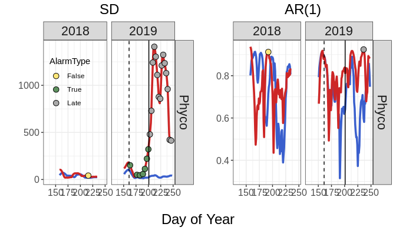

<!-- README.md is generated from README.Rmd. Please edit that file -->

# tvsews

<!-- badges: start -->
<!-- badges: end -->

tvsews is an R package that provides code and data for a whole-lake
fertilization experiment that caused an algal bloom in order to compared
the performance of early warning statistics (EWS) in temporal and
spatial data. It is currently under development.

## Installation

You can install the development version from
[GitHub](https://github.com/) with:

``` r
# install.packages("devtools")
devtools::install_github("cbuelo/tvsews")
```

## Example

Example results from most recent experiment:

### Set up and visualize time series data

``` r
library(tvsews)
library(dplyr)
library(ggplot2)
ex_data <- ts_data %>%
  filter(Year >= 2018) %>%
  select(Lake, Year, DOY, BGA_HYLB)

ex_bloom_fert_dates <- bloom_fert_dates %>%
  filter(Year >= 2018 & Lake == "R")

plot_state_vars(
  time_series = ex_data,
  bloom_fert_df = ex_bloom_fert_dates,
  var_rename_vec = c(`Phycocyanin (cells/mL)` = "BGA_HYLB"),
  legend_location = c(0.18, 0.7)
)
```


### Calculate rolling window statistics and quickest detection alarms

``` r
ex_rw_stats <- calc_rolling_stats(
  data = ex_data,
  var_cols = "BGA_HYLB",
  widths = c(21)
) # warnings are missing data, okay
ex_qd_all <- run_qd(
  rolling_window_stats = ex_rw_stats,
  var_cols = "BGA_HYLB",
  widths = c(21),
  stats_to_qd = c("SD", "Ar1"),
  exp_lakes = c("R"),
  ref_lake = "L",
  ar1_alarm_rho = 0.95
)
#> [1] "Current variable QD-ing: BGA_HYLB"
ex_qd_formatted <- format_qd(
  qd_stats = ex_qd_all,
  var_cols = c("BGA_HYLB")
)
```

``` r
# plot the rolling window statistics and alarms
time_series_plot <- plot_temporal_EWS(
  rolling_window_stats = ex_rw_stats,
  qd_alarms = ex_qd_formatted,
  bloom_fert_df = ex_bloom_fert_dates,
  var_rename_vec = c(`Phyco` = "BGA_HYLB"),
  legend_location = c(0.2, 0.7)
)
```



### Calculate and plot true and false alarm rates

``` r
alarm_rates <- calc_alarm_rates(
  qd_alarms = ex_qd_formatted,
  bloom_fert_df = bloom_fert_dates
)

plot_alarm_rates(
  qd_alarm_rates = alarm_rates,
  var_rename_vec = c("Phycocyanin" = "BGA_HYLB"),
  legend_title = "Positive Alarm Rate"
)
```


### Plot example spatial data

``` r
plot_spatial_data(
  spatial_data = flame_data,
  samples_to_plot = data.frame(Year = 2019, DOY = c(165, 210, 228), stringsAsFactors = FALSE),
  var_cols = c("BGApc_ugL_tau")
)
```


### Calculate spatial statistics

#### Just dates in pre-bloom fertilization period to limit computation time.

``` r
ex_spatial_data_pbfp <- flame_data %>%
  filter(Year == 2019 & between(DOY, 161, 201))

spatial_stats_pbfp <- calc_spatial_stats(
  spatial_data = ex_spatial_data_pbfp,
  var_cols = c("BGApc_ugL_tau")
) # ignore estimated time as not using all of default data
```

### Plot spatial statistics

``` r
spatial_results_plot <- plot_spatial_EWS(spatial_stats_pbfp)
```


(`devtools::build_readme()`to render)
