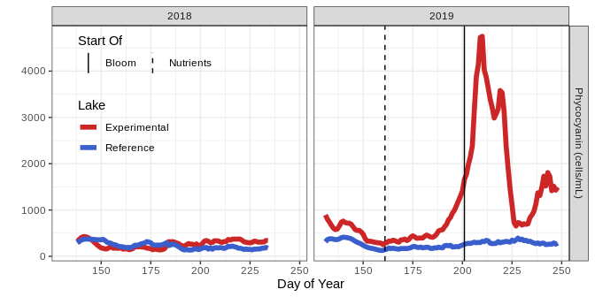
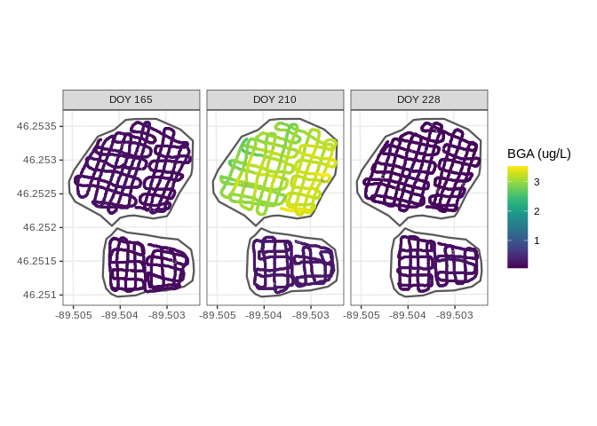
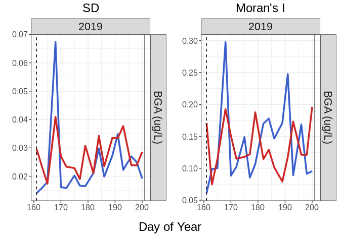

<!-- README.md is generated from README.Rmd. Please edit that file -->
# tvsews

<!-- badges: start -->
<!-- badges: end -->
tvsews is to provides code and data for a manuscript (in preparation) associated with a whole-lake fertilization experiment that compared the performance of early warning statistics (EWS) in temporal and spatial data.

## Installation

You can install the development version from [GitHub](https://github.com/) with:

``` r
# install.packages("devtools")
devtools::install_github("cbuelo/tvsews")
```

## Example

Results from most recent experiment:

### Set up and visualize time series data

``` r
library(tvsews)
library(dplyr)
library(ggplot2)
ex_data <- ts_data %>% 
  filter(Year >= 2018) %>% 
  select(Lake, Year, DOY, BGA_HYLB)

ex_bloom_fert_dates <- bloom_fert_dates %>% 
  filter(Year >= 2018 & Lake == "R")

plot_fig1(
  time_series = ex_data, 
  bloom_fert_df = ex_bloom_fert_dates,
  var_rename_vec = c(`Phycocyanin (cells/mL)` = "BGA_HYLB"),
  legend_location = c(0.18,0.7)
  )
```



### Calculate rolling window statistics and quickest detection alarms

``` r
ex_rw_stats <- calc_rolling_stats(
  data = ex_data,
  var_cols = "BGA_HYLB",
  widths = c(21)
  ) # warnings are missing data, okay
ex_qd_all <- run_qd(
  rolling_window_stats = ex_rw_stats,
  var_cols = "BGA_HYLB",
  widths = c(21),
  stats_to_qd = c("SD", "Ar1"),
  exp_lakes = c("R"),
  ref_lake = "L",
  ar1_alarm_rho = 0.95
  )
#> [1] "Current variable QD-ing: BGA_HYLB"
ex_qd_formatted <- format_qd(
  qd_stats = ex_qd_all,
  var_cols = c("BGA_HYLB")
  )
```

``` r
# plot the rolling window statistics and alarms
time_series_plot = plot_fig3(
  rolling_window_stats = ex_rw_stats,
  qd_alarms = ex_qd_formatted,
  bloom_fert_df = ex_bloom_fert_dates,
  var_rename_vec = c(`Phycocyanin (cells/mL)` = "BGA_HYLB"), 
  legend_location = c(0.2, 0.7)
)
```


### Calculate and plot true and false alarm rates

``` r
alarm_rates <- calc_alarm_rates(
  qd_alarms = ex_qd_formatted,
  bloom_fert_df = bloom_fert_dates
)

plot_fig5(
  qd_alarm_rates = alarm_rates,
  var_rename_vec = c("Phycocyanin" = "BGA_HYLB"),
  title = "Positive Alarm Rate"
)
```


### Plot example spatial data (TO DO: add function to package)

``` r
ex_spatial_data = flame_data %>% 
  filter(Year == 2019 & DOY == 214)

ggplot(ex_spatial_data, aes(x=longitude, y=latitude, color=BGApc_ugL_tau)) + 
  geom_point() + 
  theme_bw() +
  scale_color_viridis_c()
```



### Calculate spatial statistics

#### Just dates in pre-bloom fertilization period to limit computation time.

``` r
ex_spatial_data_pbfp = flame_data %>% 
  filter(Year == 2019 & between(DOY, 161, 201))

spatial_stats_pbfp = calc_spatial_stats(
  spatial_data = ex_spatial_data_pbfp,
  var_cols = c("BGApc_ugL_tau")
  ) # ignore estimated time as not using all of default data
```

### Plot spatial statistics (TO DO: add function to package)

``` r
spatial_stats_pbfp %>% 
  mutate(Lake = ifelse(Lake == "R", "Experimental", "Reference")) %>% 
  mutate(Stat = factor(Stat, levels = c("SD", "Moran's I"), ordered = TRUE)) %>% 
  ggplot(aes(x=DOY, y=Value, color=Lake)) +
  geom_line(size=2) +
  facet_grid(rows=vars(Stat), scales="free_y") +
  theme_bw() + 
  scale_color_manual(values = c("Experimental" = "firebrick3", "Reference" = "royalblue3"))
```



(`devtools::build_readme()`to render)
